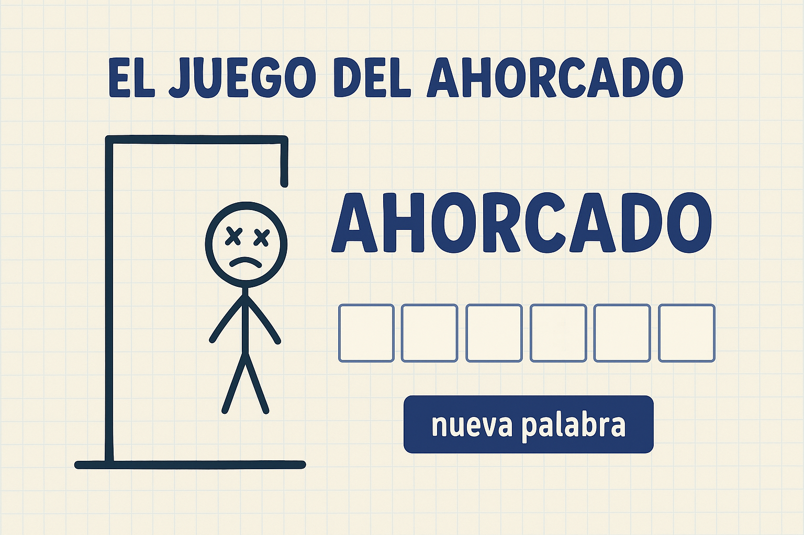
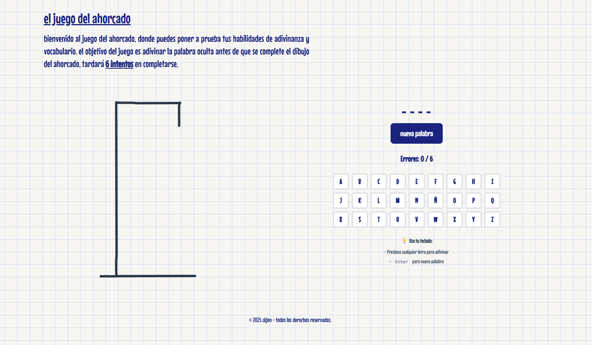

# 🎮 Juego del Ahorcado

Un moderno juego del ahorcado desarrollado con **Astro**, **Preact** y **Tailwind CSS**. Diseñado con una interfaz intuitiva, efectos de dibujo a mano y soporte completo para teclado físico.

## ✨ Características

- 🎨 **Dibujo artístico**: Canvas con efectos de trazos dibujados a mano
- ⌨️ **Soporte de teclado**: Juega con teclado virtual o físico
- 📱 **Diseño responsivo**: Optimizado para móviles y escritorio
- 🎯 **Interfaz moderna**: UI limpia con Tailwind CSS
- 🔄 **Reinicio rápido**: Nueva palabra con un clic o tecla Enter
- 🎪 **Efectos visuales**: Cara expresiva con ojos X y lengua fuera
- 📚 **Gran vocabulario**: Más de 200 palabras en español

## 🚀 Demo en vivo

[Ver el juego en vivo](https://hangman.zkjon.dev)

## 📷 Captura de pantalla



## 🛠️ Tecnologías utilizadas

- **[Astro](https://astro.build/)** - Framework web moderno
- **[Preact](https://preactjs.com/)** - Librería de componentes ligera
- **[Tailwind CSS](https://tailwindcss.com/)** - Framework de CSS utility-first
- **[TypeScript](https://www.typescriptlang.org/)** - Tipado estático
- **HTML Canvas** - Para el dibujo del ahorcado

## 🎮 Cómo jugar

1. **Objetivo**: Adivina la palabra oculta antes de completar el dibujo del ahorcado
2. **Mecánica**: Tienes 6 intentos máximo (cada error agrega una parte al dibujo)
3. **Controles**:
   - 🖱️ **Ratón**: Haz clic en las letras del teclado virtual
   - ⌨️ **Teclado**: Presiona cualquier letra A-Z o Ñ
   - ↩️ **Enter**: Nueva palabra / Reiniciar juego

## 🚀 Instalación y desarrollo

### Prerrequisitos

- **Node.js** 18+ 
- **pnpm** (recomendado) o npm

### Instalación

```bash
# Clonar el repositorio
git clone https://github.com/tu-usuario/hangman.git
cd hangman

# Instalar dependencias
pnpm install

# Iniciar servidor de desarrollo
pnpm dev
```

El servidor estará disponible en `http://localhost:4321`

## 🎯 Características técnicas

### Componentes modulares
- **Separación de responsabilidades**: Cada componente tiene una función específica
- **Reutilización**: Componentes independientes y reutilizables
- **Mantenibilidad**: Código limpio y bien organizado

### Hook personalizado
- **useHangmanGame**: Maneja toda la lógica del juego
- **Estado centralizado**: Un solo lugar para el estado del juego
- **Eventos de teclado**: Manejo completo de interacciones

### Canvas artístico
- **Algoritmo de dibujo a mano**: Simula trazos naturales
- **Renderizado consistente**: Mismo aspecto en cada renderizado
- **Escalado responsivo**: Se adapta a diferentes tamaños de pantalla

## 🎨 Personalización

### Agregar nuevas palabras

Edita el archivo `src/lib/words.ts`:

```typescript
export const words = [
  'TU_NUEVA_PALABRA',
  // ... más palabras
];
```

### Modificar dificultad

Cambia `MAX_ERRORS` en `src/hooks/useHangmanGame.ts`:

```typescript
const MAX_ERRORS = 6; // Cambiar a 4, 8, etc.
```

### Personalizar estilos

Los estilos están en `src/styles/globals.css` y clases de Tailwind en los componentes.

## 🤝 Contribución

1. **Fork** el proyecto
2. Crea una **rama** para tu feature (`git checkout -b feature/nueva-caracteristica`)
3. **Commit** tus cambios (`git commit -m 'Agregar nueva característica'`)
4. **Push** a la rama (`git push origin feature/nueva-caracteristica`)
5. Abre un **Pull Request**

## 📝 Licencia

Este proyecto está bajo la Licencia MIT - ver el archivo [LICENSE](LICENSE) para más detalles.

## 👨‍💻 Autor

**zkjon** - [@zkjon](https://github.com/zkjon)

## 🙏 Agradecimientos

- Inspirado en el clásico juego del ahorcado
- Desarrollado con las mejores prácticas modernas de React/Preact
- Diseño responsive con Tailwind CSS

---

⭐ **¡Dale una estrella si te gustó el proyecto!** ⭐
